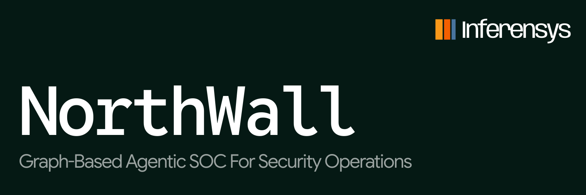
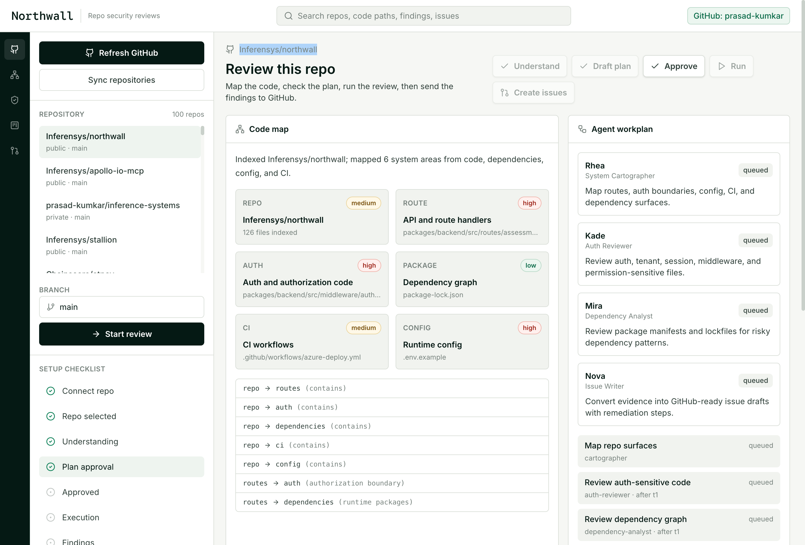

Security operations teams don't need another alert queue.

Northwall is an Agentic SOC platform. It brings specialist agents into the work analysts already do: alert triage, threat investigation, investigation graphs, response planning, and owner handoff.

The point is not to replace the SOC analyst. The point is to stop making analysts copy evidence between CrowdStrike, Microsoft Sentinel, GitHub, Snyk, Semgrep, Jira, and Slack just to answer the same 5 questions.

What happened? Is it real? What systems are touched? Who owns the fix? What should we do next?

Northwall turns that into a controlled multi-agent run.

## What Northwall Is

Northwall is an agentic SOC product for multi-agent security operations. It shows how a security operations center can use AI agents for alert triage, threat investigation, incident context building, response planning, and remediation handoff while keeping analysts in control.

It is not a chatbot bolted onto a SIEM. It is a workflow layer for SOC automation where every agent has a job, every action is visible, and every finding has evidence attached.

This is the category EY is pointing at with [Agentic SOC](https://www.ey.com/en_in/insights/ai/agentic-soc-multi-agent-orchestration-for-next-gen-security-operations): defenders moving from alert handling to supervising agent teams that can reason across the environment. Northwall shows that pattern in product form, starting with GitHub context and work-item creation.

Useful market terms, written plainly: agentic SOC, multi-agent security operations, SOC automation, alert triage, threat investigation, incident response, investigation graph, response plan, human-in-the-loop security, SIEM, EDR, cloud security, identity security, GitHub security, Jira security workflows.

## Core Flow

```text
Connect source -> Build context -> Review agent plan -> Run investigation -> Approve handoff -> Create work items
```

- GitHub OAuth as the first source and remediation connector
- Source repository, branch, package, route, auth, config, and CI context
- Investigation graph across alerts, services, owners, code paths, and work items
- Agent task map before the run starts
- Human approval gate before response actions
- Live Socket.IO event stream while agents work
- Findings with severity, confidence, evidence, owner, response step, issue body, and labels
- GitHub work item creation only after the user selects findings

The GitHub path is the first slice. The product direction is broader: SIEM, EDR, cloud, identity, source control, ticketing, and evidence storage.

## Product



## How It Works

The backend keeps source and model credentials server-side.

When a user connects GitHub, Northwall stores the provider token through encrypted local persistence keyed by `TOKEN_ENCRYPTION_KEY`. The frontend only sees connection metadata: account, scopes, and connection time.

When a run starts, the backend reads the selected repo through the GitHub API. Today it inventories files that usually matter during a security investigation:

- package manifests and lockfiles
- API routes and handlers
- auth, session, tenant, middleware, and permission files
- environment/config files
- GitHub Actions and CI files
- service ownership and work item context

OpenAI GPT-5.5 runs on the backend. It turns the source inventory into an agent plan and owner handoff drafts. The prompts stay defensive: owned systems, concrete evidence, no third-party targets, no destructive actions, no exploit payloads.

## Packages

| Package | Role |
| --- | --- |
| `@northwall/frontend` | Next.js app shell, source picker, investigation graph, plan approval, live SOC run, findings table |
| `@northwall/backend` | Hono API, GitHub integration, investigation worker, OpenAI planning, Socket.IO events |
| `@northwall/shared` | Zod schemas for sources, runs, graphs, plans, findings, and work item payloads |
| `@northwall/agent-runtime` | Existing agent runtime kept for future worker expansion |
| `@northwall/agent-control` | Existing sandbox control service kept for deeper runtime checks |

## Stack

- Next.js 15
- React 19
- Tailwind CSS
- Hono
- Socket.IO
- Zod
- Supabase Auth
- GitHub REST API
- OpenAI SDK with Azure-compatible `OPENAI_BASE_URL`

## Local Setup

Install dependencies:

```bash
npm install
cp .env.example .env
```

Set backend secrets in `.env`:

```bash
OPENAI_BASE_URL=
OPENAI_API_KEY=
OPENAI_MODEL=gpt-5.5
TOKEN_ENCRYPTION_KEY=
```

For local development without Supabase, use a server-side GitHub token:

```bash
DEV_AUTH_BYPASS=true
GITHUB_TOKEN=
GITHUB_ACCOUNT=
```

Start the backend:

```bash
npm run dev:backend
```

Start the frontend:

```bash
NEXT_PUBLIC_DEV_AUTH_BYPASS=true \
NEXT_PUBLIC_BACKEND_URL=http://localhost:4000 \
npm run dev:frontend
```

Open:

```text
http://localhost:3000
```

## Production Auth

Northwall uses Supabase GitHub OAuth for the first connector.

Configure GitHub as the provider in Supabase and request repo access for private repository read plus issue creation.

Required environment:

| Variable | Purpose |
| --- | --- |
| `SUPABASE_URL` | Backend JWT issuer/JWKS lookup |
| `NEXT_PUBLIC_SUPABASE_URL` | Frontend Supabase project URL |
| `NEXT_PUBLIC_SUPABASE_ANON_KEY` | Frontend Supabase anon key |
| `TOKEN_ENCRYPTION_KEY` | Encrypts stored GitHub provider tokens |
| `OPENAI_BASE_URL` | Azure/OpenAI-compatible endpoint |
| `OPENAI_API_KEY` | Backend-only model key |
| `OPENAI_MODEL` | Defaults to `gpt-5.5` |

## SOC Safety Boundaries

Northwall is for owned systems and authorized security operations work.

It starts with safe triage, static context, dependency context, and owner handoff. It does not run third-party scanning, destructive tests, credential collection, persistence checks, or weaponized exploit output.

The output is plain: what happened, why it matters, what evidence supports it, who owns it, and what work item should be created.

## Work With Us

We build products like this for teams that want agentic security operations without turning the SOC into a black box.


Talk to [Inferensys](https://inferensys.com/) or contact us at [inferensys.com/contact](https://inferensys.com/contact).
