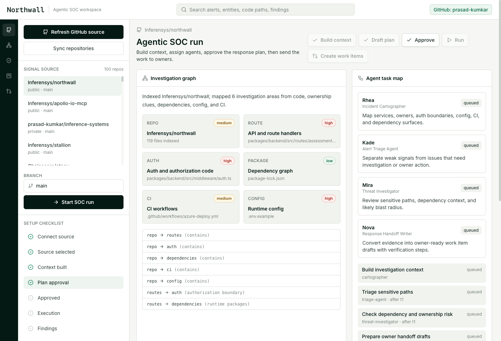
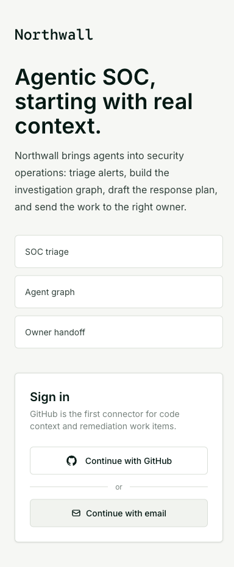

Security tools are good at alerts. Engineers still get stuck with the cleanup.

Northwall connects to GitHub, reads the repo, maps the risky parts, drafts a review plan, runs safe checks, and opens GitHub issues when you approve the findings.

Snyk can flag a package. Semgrep can catch a bad pattern. GitHub Advanced Security can warn on a secret. The annoying work starts after that: is this reachable, who owns it, what proof do we have, and what should the issue say?

That is the job Northwall takes on.

## Core Flow

```text
Sign in with GitHub -> Pick repo and branch -> Understand code -> Review plan -> Run -> Create issues
```

- GitHub OAuth for repo access
- Repository and branch selection
- Static repo understanding for packages, routes, auth code, config, CI, and dependency files
- Code map showing routes, packages, auth paths, config, CI, and data edges
- Agent workplan before execution
- Approval gate before any run starts
- Live Socket.IO event stream while tasks execute
- Findings with severity, confidence, evidence, issue title, issue body, and labels
- GitHub issue creation only after the user selects findings

## Product Screens

Key screens:





## How It Works

The backend keeps GitHub and model credentials server-side.

When a user connects GitHub, Northwall stores the provider token through encrypted local persistence keyed by `TOKEN_ENCRYPTION_KEY`. The frontend only sees connection metadata: account, scopes, and connection time.

When a review starts, the backend reads the selected repo through the GitHub API. It inventories files that usually matter in AppSec work:

- package manifests and lockfiles
- API routes and handlers
- auth, session, tenant, middleware, and permission files
- environment/config files
- GitHub Actions and CI files

OpenAI GPT-5.5 runs on the backend. It turns the repo inventory into a plan and finding drafts. The prompts stay defensive: owned repos, static and dependency analysis, concrete evidence, no third-party targets, no destructive tests, no exploit payloads.

## Packages

| Package | Role |
| --- | --- |
| `@northwall/frontend` | Next.js app shell, repo picker, code map, plan approval, live run, findings table |
| `@northwall/backend` | Hono API, GitHub integration, assessment worker, OpenAI planning, Socket.IO events |
| `@northwall/shared` | Zod schemas for repos, assessments, graphs, plans, findings, and issue payloads |
| `@northwall/agent-runtime` | Existing agent runtime kept for future worker expansion |
| `@northwall/agent-control` | Existing sandbox control service kept for deeper runtime checks |

## Stack

- Next.js 15
- React 19
- Tailwind CSS
- Hono
- Socket.IO
- Zod
- Supabase Auth
- GitHub REST API
- OpenAI SDK with Azure-compatible `OPENAI_BASE_URL`

## Local Setup

Install dependencies:

```bash
npm install
cp .env.example .env
```

Set backend secrets in `.env`:

```bash
OPENAI_BASE_URL=
OPENAI_API_KEY=
OPENAI_MODEL=gpt-5.5
TOKEN_ENCRYPTION_KEY=
```

For local development without Supabase, use a server-side GitHub token:

```bash
DEV_AUTH_BYPASS=true
GITHUB_TOKEN=
GITHUB_ACCOUNT=
```

Start the backend:

```bash
npm run dev:backend
```

Start the frontend:

```bash
NEXT_PUBLIC_DEV_AUTH_BYPASS=true \
NEXT_PUBLIC_BACKEND_URL=http://localhost:4000 \
npm run dev:frontend
```

Open:

```text
http://localhost:3000
```

## Production Auth

Northwall uses Supabase GitHub OAuth.

Configure GitHub as the provider in Supabase and request repo access for private repository read plus issue creation.

Required environment:

| Variable | Purpose |
| --- | --- |
| `SUPABASE_URL` | Backend JWT issuer/JWKS lookup |
| `NEXT_PUBLIC_SUPABASE_URL` | Frontend Supabase project URL |
| `NEXT_PUBLIC_SUPABASE_ANON_KEY` | Frontend Supabase anon key |
| `TOKEN_ENCRYPTION_KEY` | Encrypts stored GitHub provider tokens |
| `OPENAI_BASE_URL` | Azure/OpenAI-compatible endpoint |
| `OPENAI_API_KEY` | Backend-only model key |
| `OPENAI_MODEL` | Defaults to `gpt-5.5` |

## Safety Boundaries

Northwall is for owned repositories and authorized engineering work.

It does static and dependency-oriented analysis first. It does not run third-party scanning, destructive tests, credential collection, persistence checks, or weaponized exploit output.

The output is plain: evidence, impact, a fix plan, and a GitHub issue the owner can act on.

## Work With Us

We build products like this for teams that want useful multi-agent systems, not theater.


Talk to [Inferensys](https://inferensys.com/) or contact us at [inferensys.com/contact](https://inferensys.com/contact).
