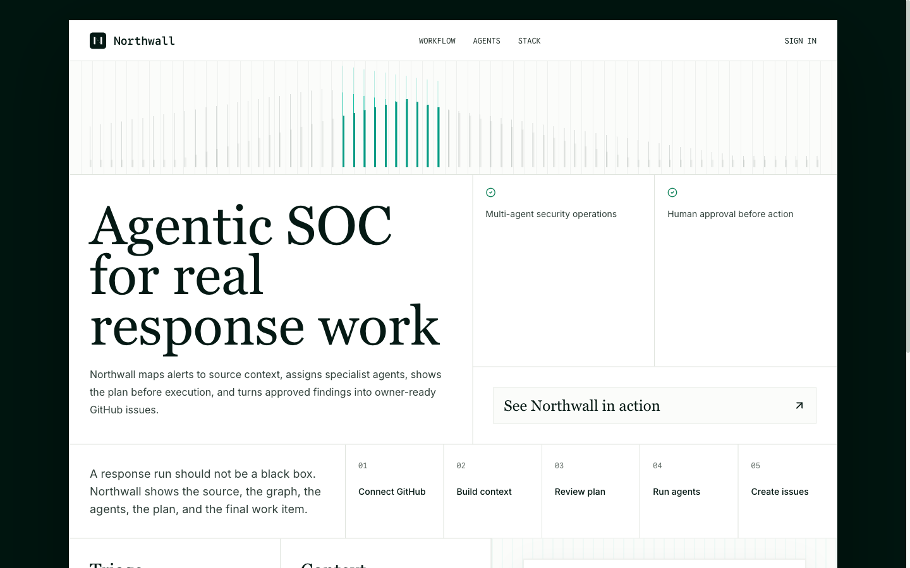
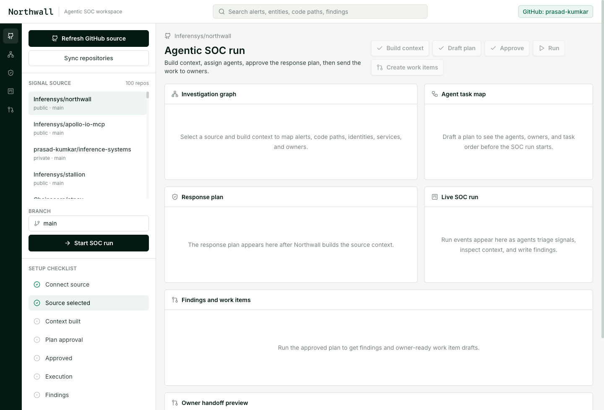
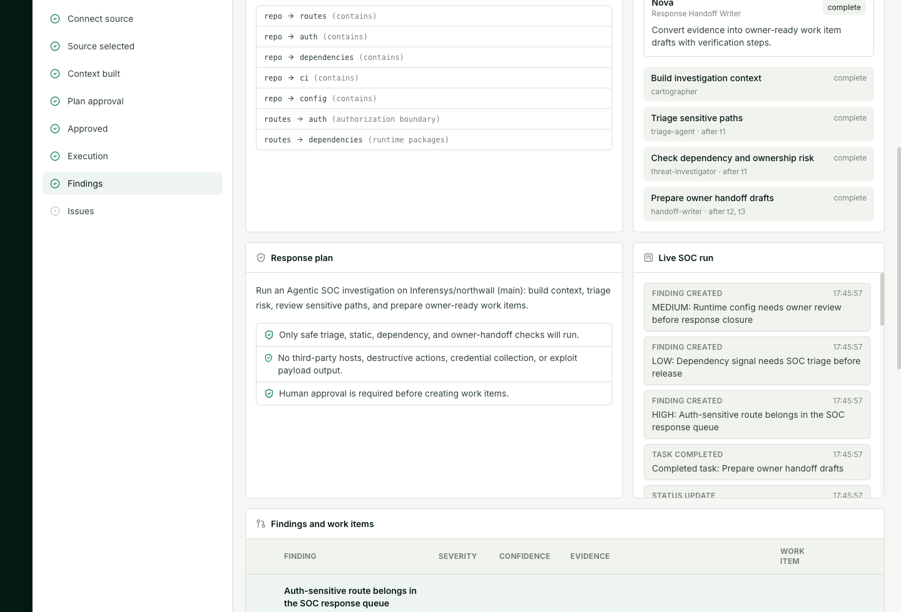
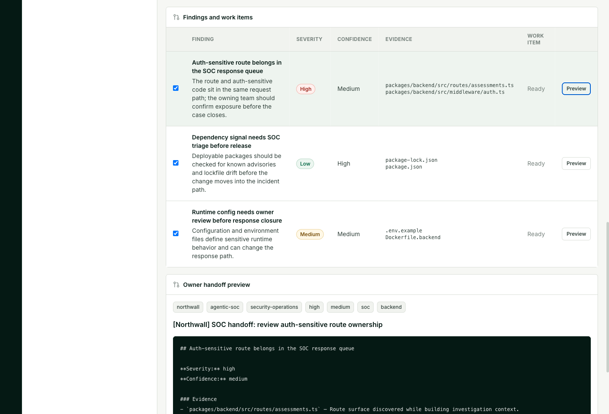

# Run AppSec missions with specialist AI agents

Northwall orchestrates specialist AI agents across code, ownership, dependencies, and security context to turn AppSec risk into approved, owner-ready action.

Most security tools hand leaders another queue. Scanners produce alerts, code review bots produce comments, and engineers still have to answer the hard operational questions: what is reachable, which owner should act, what evidence is strong enough, and what should the remediation work actually say?

Northwall is an Agentic AppSec Orchestration product. It builds an application knowledge graph first, dispatches a governed team of security agents, runs safe parallel investigation loops, and keeps humans in control before work is sent to owners.

GitHub is the first execution surface: source context, branch selection, code ownership, dependency evidence, and GitHub issue handoff. The same orchestration pattern is designed to extend to SIEM, EDR, cloud, identity, ticketing, and evidence storage without claiming those connectors as the default path today.

## Core Flow

```text
Connect evidence source -> Build graph -> Approve agent mission -> Run parallel specialists -> Send owner handoffs
```

- GitHub OAuth for source context and approved remediation handoff
- Repo, branch, package, route, auth, config, ownership, and CI inventory
- AppSec knowledge graph across services, routes, owners, dependencies, controls, and work items
- Specialist agents with named responsibilities before execution starts
- Parallel MoE-style investigation across auth, dependency, ownership, config, CI, and threat context
- Human approval before the mission runs and before work is sent to owners
- Live Socket.IO event stream while agents execute
- Owner handoffs with severity, confidence, evidence, remediation, verification notes, issue body, and labels

## Why Northwall

| Alternative | What it gives you | What Northwall adds |
| --- | --- | --- |
| Scanners | Findings, alerts, and severity queues | Governed agentic execution that turns evidence into owner-ready action |
| AI code review bots | Comments on code changes | Application graph context, specialist agents, and approval-gated remediation handoff |
| Manual AppSec triage | Expert judgment, but limited throughput | Parallel specialists that map, triage, verify, and draft work while analysts stay in control |

## Agent Team

Northwall plans the mission before execution so reviewers can see the team, task order, evidence goals, and approval notes.

| Agent | Responsibility |
| --- | --- |
| System Cartographer | Builds the AppSec knowledge graph across repos, routes, packages, owners, controls, and CI. |
| Auth Boundary Agent | Reviews auth, session, tenant, middleware, and permission-sensitive paths. |
| Dependency Analyst | Checks package manifests, lockfiles, dependency exposure, and release risk. |
| CI/Config Analyst | Reviews pipeline, runtime configuration, environment references, and guardrails. |
| Response Handoff Agent | Converts evidence into owner-ready remediation work with verification steps. |
| Human Review Agent | Keeps scope, approval, and risky actions behind explicit analyst control. |

## Demo



[Watch the 15-second walkthrough](docs/northwall-agentic-soc-demo.mp4)

<video src="docs/northwall-agentic-soc-demo.mp4" controls width="100%"></video>

### Connect an evidence source

Pick a GitHub repo and branch. Northwall keeps provider tokens server-side.



### Approve the agent plan

Northwall builds AppSec graph context first, then shows the agent team, task order, evidence goals, and approval notes before anything runs.


### Watch the mission run

The run log shows which specialist agents are executing, which evidence was used, and which owner handoffs were drafted.



### Send work to owners

Handoffs are selected by the analyst, previewed as GitHub issues, and sent only after approval.



### Mobile sign-in


## How It Works

The backend keeps source and model credentials server-side.

When a user connects GitHub, Northwall stores the provider token through encrypted local persistence keyed by `TOKEN_ENCRYPTION_KEY`. The frontend only sees connection metadata: account, scopes, and connection time.

When a mission starts, the backend reads the selected repo through the GitHub API and inventories the files that usually matter during AppSec operations:

- package manifests and lockfiles
- API routes and handlers
- auth, session, tenant, middleware, and permission files
- environment and config files
- GitHub Actions and CI files
- service ownership and work item context

OpenAI GPT-5.5 runs on the backend. It turns the source inventory and AppSec graph into an agent plan and owner handoff drafts. The prompts stay defensive: owned systems, static/dependency analysis, concrete evidence, no third-party targets, no destructive actions, no exploit payloads.

## Packages

| Package | Role |
| --- | --- |
| `@northwall/frontend` | Next.js app, source picker, AppSec graph, agent plan approval, live mission, owner handoff table |
| `@northwall/backend` | Hono API, GitHub integration, mission worker, OpenAI planning, Socket.IO events |
| `@northwall/shared` | Zod schemas for repos, runs, graphs, plans, handoffs, and issue payloads |
| `@northwall/agent-runtime` | Agent runtime kept for deeper worker expansion |
| `@northwall/agent-control` | Sandbox control service kept for future runtime checks |

## Stack

- Next.js 15
- React 19
- Tailwind CSS
- Hono
- Socket.IO
- Zod
- Supabase Auth
- GitHub REST API
- OpenAI SDK with Azure-compatible `OPENAI_BASE_URL`

## Local Setup

Install dependencies:

```bash
npm install
cp .env.example .env
```

Set backend secrets in `.env`:

```bash
OPENAI_BASE_URL=
OPENAI_API_KEY=
OPENAI_MODEL=gpt-5.5
TOKEN_ENCRYPTION_KEY=
```

For local development without Supabase, use a server-side GitHub token:

```bash
DEV_AUTH_BYPASS=true
GITHUB_TOKEN=
GITHUB_ACCOUNT=
```

Start the backend:

```bash
npm run dev:backend
```

Start the frontend:

```bash
NEXT_PUBLIC_DEV_AUTH_BYPASS=true \
NEXT_PUBLIC_BACKEND_URL=http://localhost:4000 \
npm run dev:frontend
```

Open:

```text
http://localhost:3000
http://localhost:3000/workspace
```

## Production Auth

Northwall uses Supabase GitHub OAuth for the first connector.

Configure GitHub as the provider in Supabase and request repo access for private repository read plus issue creation.

Required environment:

| Variable | Purpose |
| --- | --- |
| `SUPABASE_URL` | Backend JWT issuer/JWKS lookup |
| `NEXT_PUBLIC_SUPABASE_URL` | Frontend Supabase project URL |
| `NEXT_PUBLIC_SUPABASE_ANON_KEY` | Frontend Supabase anon key |
| `TOKEN_ENCRYPTION_KEY` | Encrypts stored GitHub provider tokens |
| `OPENAI_BASE_URL` | Azure/OpenAI-compatible endpoint |
| `OPENAI_API_KEY` | Backend-only model key |
| `OPENAI_MODEL` | Defaults to `gpt-5.5` |

## Safety Boundaries

Northwall is for owned systems and authorized AppSec work.

It starts with safe source context, dependency context, graph building, agent planning, and owner handoff. It does not run third-party scanning, destructive tests, credential collection, persistence checks, or weaponized exploit output.

The output is plain: what was found, why it matters, what evidence supports it, who owns it, and what work should be created.

## Work With Us

We build products like this for teams that want agentic AppSec execution without turning remediation work into a black box.


Talk to [Inferensys](https://inferensys.com/) or contact us at [inferensys.com/contact](https://inferensys.com/contact).
